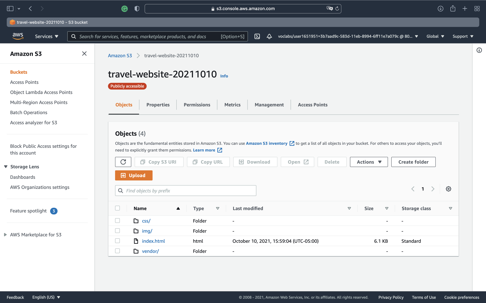
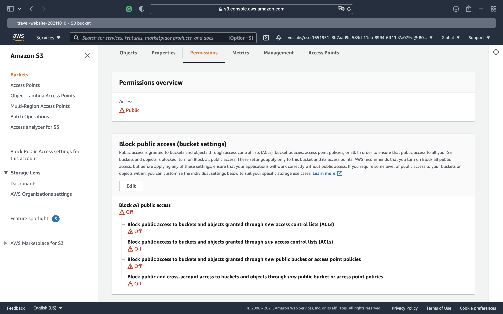
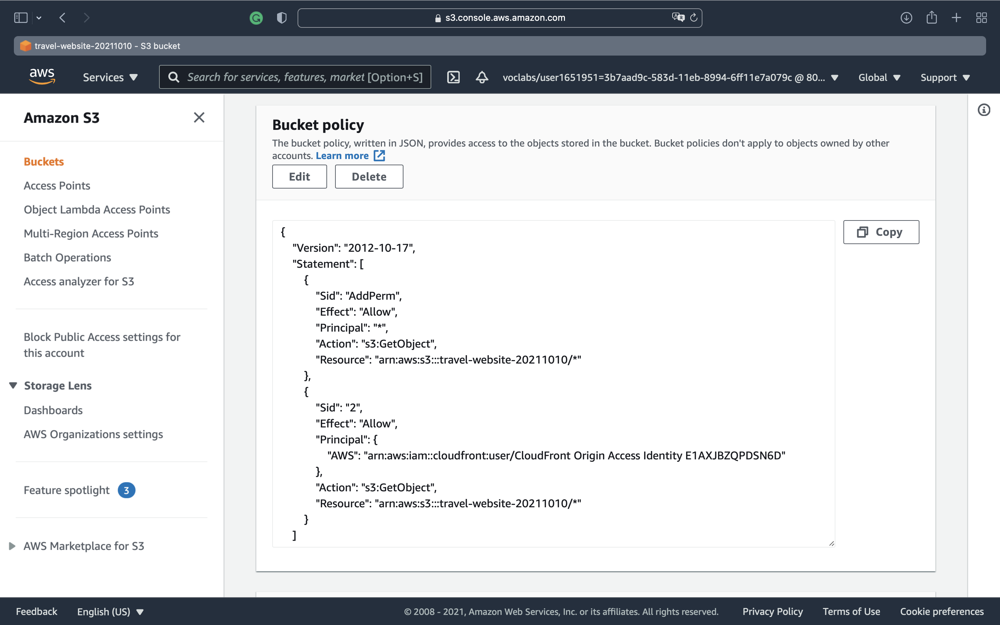
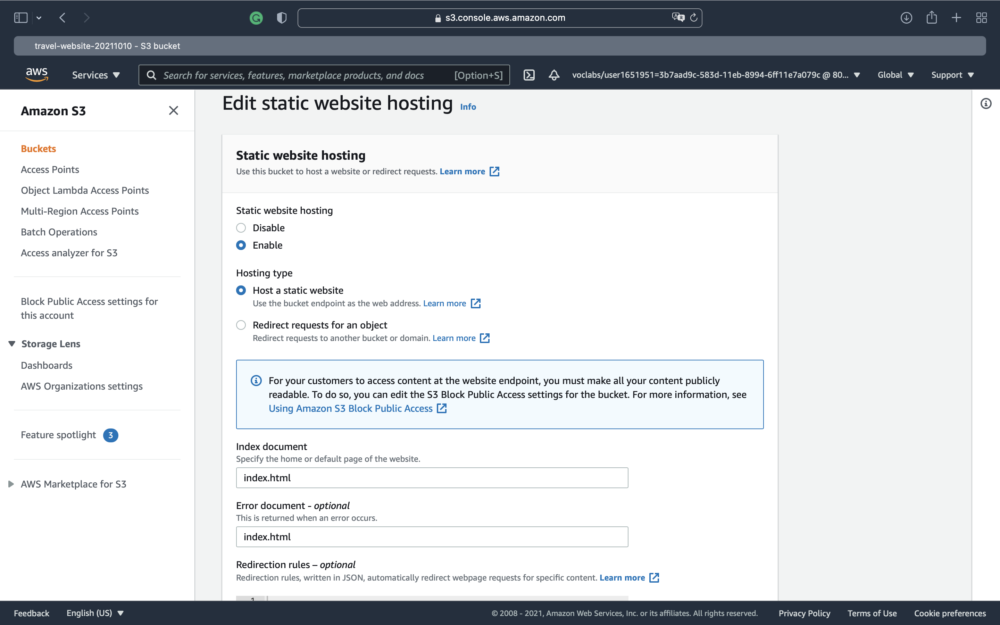
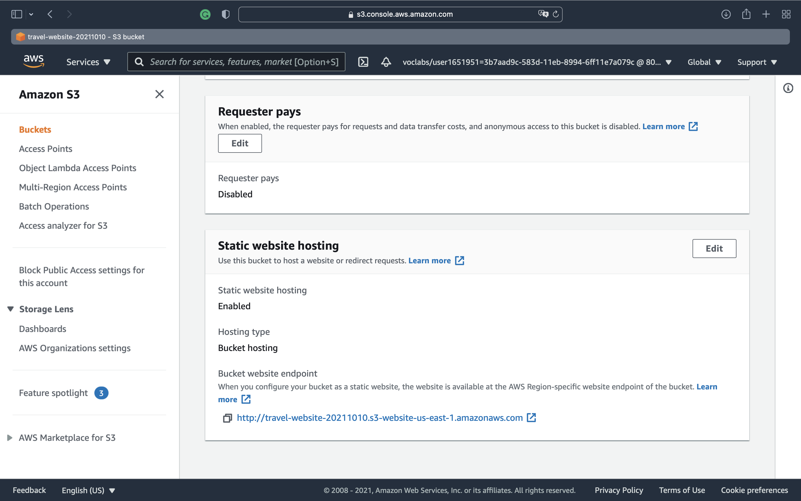
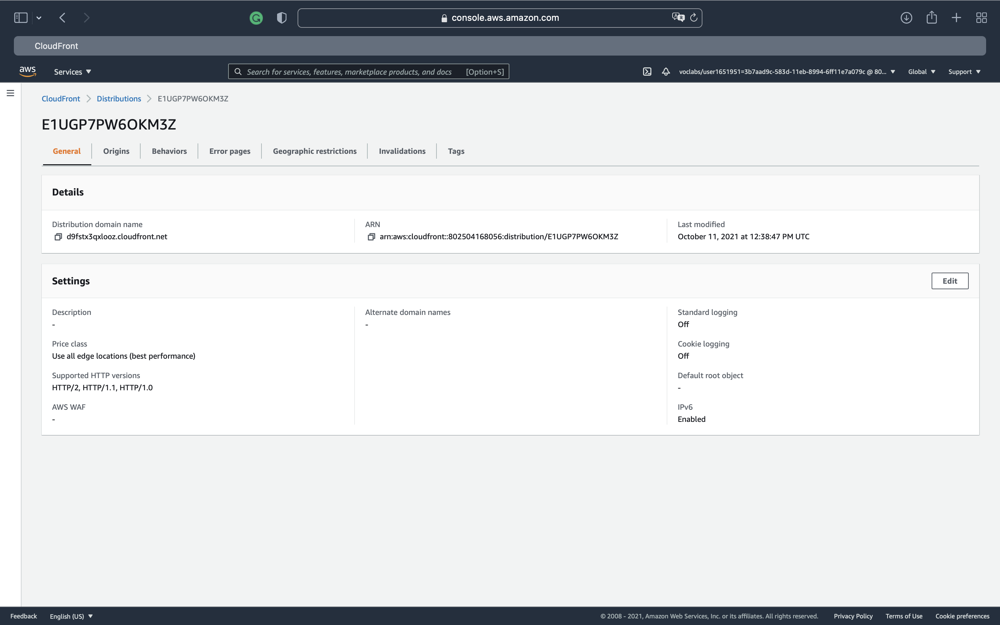
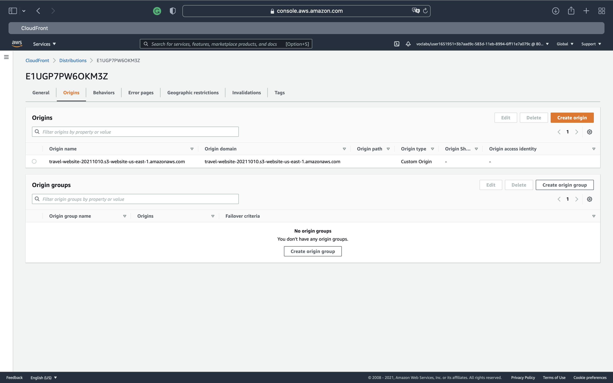
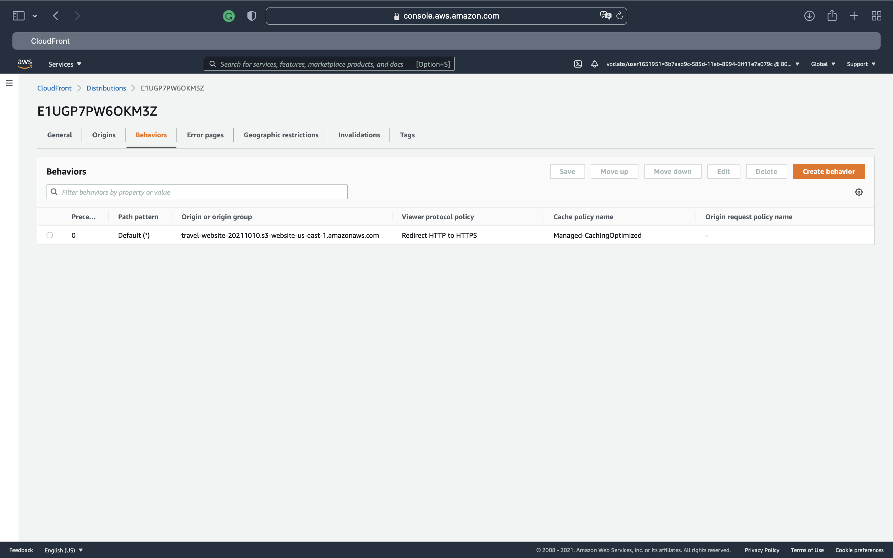
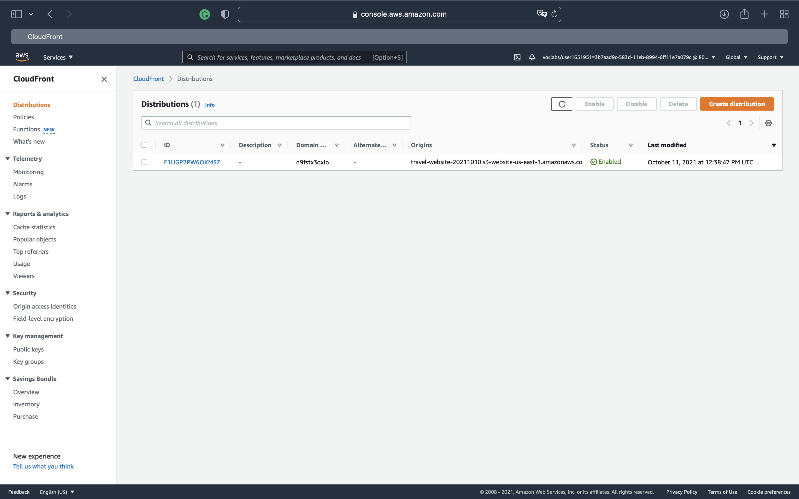

# Deploy Static Website on AWS

In this project, I deployed a static website to AWS using S3, CloudFront, and IAM.

## Project Steps
1. Create S3 Bucket (allow the public access to the bucket contents)

2. Upload website files to S3 Bucket
    

3. Secure Bucket via IAM (update access and bucket policy under the "Permissions" tab)

    
    ```
    {
    "Version":"2012-10-17",
    "Statement":[
    {
    "Sid":"AddPerm",
    "Effect":"Allow",
    "Principal": "*",
    "Action":["s3:GetObject"],
    "Resource":["arn:aws:s3:::your-website/*"]
    }
    ]
    }
    ```

    

4. Configure S3 Bucket (enable Static website hosting under the "Properties" tab)
    
    

5. Distribute Website via CloudFront (choose the origin domain `<bucket-name>.s3-website-region.amazonaws.com` and create distribution )
    
    
    
6. Check the website

    Distribution Domain Name: https://d9fstx3qxlooz.cloudfront.net

    Bucket Websit Endpoint: http://travel-website-20211010.s3-website-us-east-1.amazonaws.com
    
